 
# Boschetto Pedro Henrique - CentOS LAMPP

## Macchina virtuale - Installazione Servizi
La macchina virtuale CentOS 7 deve essere stata installata e configurata con:
- Connessione di rete.
- Utente con privilegi amministrativi.

Installazione dei servizi:
- SSH
- HTTP
- MariaDB
- PHP
- phpMyAdmin

### Servizio SSH
##### Eseguire le seguenti righe di codice:
`/etc/ssh/sshd_config` 

`yum install sshd` 
  
`systemctl start sshd` 
  
`systemctl enable sshd`  

Questi comandi sono responsabili di installare, avviare e mantenere sempre attivo il servizio.
  
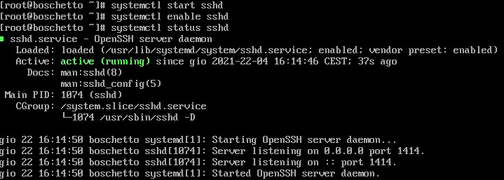 

##### Impostazioni di sicurezza
A questo punto impediremo l'accesso da remoto all'utente root della macchina virtuale utilizzando il comando:

`PermitRootLogin no`

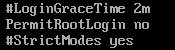 

Per rendere effettive le modifiche riavviare il servizio con `systemctl restart sshd` 
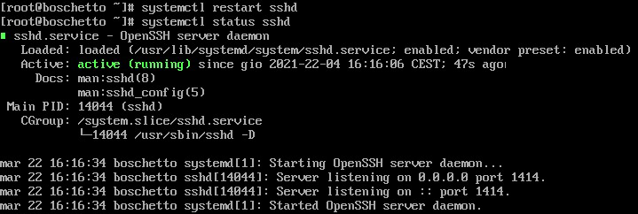 

### Servizio HTTP
##### Eseguire le seguenti righe di codice:
`yum install httpd` 

`systemctl start httpd` 

`systemctl enable httpd`  

Questi comandi sono responsabili di installare, avviare e mantenere sempre attivo il servizio.

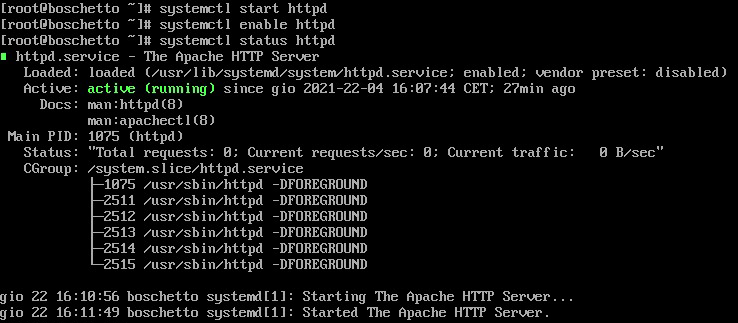 

**DocumentRoot** di Apache:
`/var/www/html` 

Configurazione delfirewall: 

`firewall-cmd --permanent --add-port=80/tcp` 
`firewall-cmd --reload`  
  
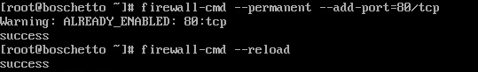 

### Servizio MariaDB
Installazione del servizio (`mariadb-server`) e del client CLI (`mariadb`)

`yum install mariadb-server mariadb` 
`systemctl start mariadb` 
`systemctl enable mariadb` 
`mysql_secure_installation`  

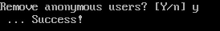 
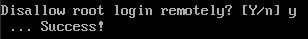 

### Servizio PHP
Installazione della versione default di PHP
`yum install php` 
`systemctl restart httpd` 
`php -v` 

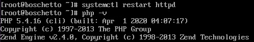 
Per verificare il funzionamento del servizio PHP appena installato seguire il seguente procedimento:
Eseguire il comando
`info.php`, nella **DocumentRoot** 

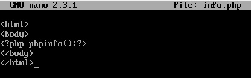 

Andare su un qualsiasi browser da host remoto e inserire il seguente link:
`http://<ip_macchina_virtuale>/info.php`  

### Servizio phpMyAdmin
##### File di configurazione del servizio
`/etc/httpd/conf.d/phpMyAdmin.conf`  

Repo aggiuntivo: `EPEL repo`  

`yum install epel-release`  

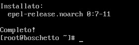 

Installazione phpMyAdmin: 

`yum install phpmyadmin`  

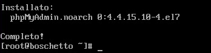 
Con un qualsiasi browser verificare il funzionamento del servizio. 
`http://<ip_macchina_virtuale>/phpmyadmin` e accedere con le credenziali dell'utente root. 

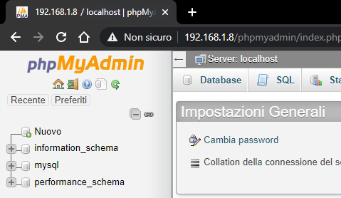 
